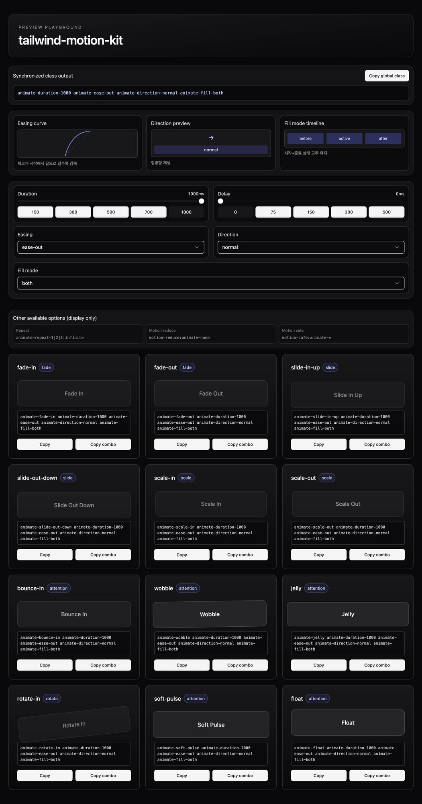

# tailwind-motion-kit

```text
┏━━━━━━━━━━━━━━━━━━━━━━━━━━━━━━━━━━━━━━━━━━━━━━━━━━━━━━━┓
┃     _____  _    ___ _ __        _____ _   _ ____      ┃
┃    |_   _|/ \  |_ _| |\ \      / /_ _| \ | |  _ \     ┃
┃      | | / _ \  | || | \ \ /\ / / | ||  \| | | | |    ┃
┃      | |/ ___ \ | || |__\ V  V /  | || |\  | |_| |    ┃
┃      |_/_/   \_\___|_____\_/\_/  |___|_| \_|____/     ┃
┗━━━━━━━━━━━━━━━━━━━━━━━━━━━━━━━━━━━━━━━━━━━━━━━━━━━━━━━┛
```

Tiny Tailwind animation kit for **fast, consistent UI motion**.

- Utility-first animation presets
- Predictable class composition
- Works great for toasts, modals, lists, and micro interactions

[Preview →](https://qpwoei0123.github.io/tailwind-motion-kit/)



---

## 30-sec quickstart

```bash
npm i tailwind-motion-kit
```

```js
// tailwind.config.js
const motionKit = require('tailwind-motion-kit')

module.exports = {
  content: ['./index.html'],
  plugins: [motionKit()],
}
```

```html
<div class="animate-fade-up animate-duration-300 animate-ease-out">Enter</div>
<div class="animate-slide-in-right animate-duration-300">Toast</div>
<div class="animate-jelly animate-duration-700 animate-ease-out">Attention</div>
```

---

## Presets

### fade
`fade-in`, `fade-out`, `fade-up`, `fade-down`, `fade-blur-in`, `fade-blur-out`

### slide
`slide-in-up`, `slide-in-left`, `slide-in-right`, `slide-in-bottom`, `slide-out-down`, `slide-out-up`, `slide-out-left`, `slide-out-right`, `slide-out-bottom`, `accordion-down`, `accordion-up`

### scale
`scale-in`, `scale-out`, `zoom-in`, `zoom-out`

### attention
`bounce-in`, `wobble`, `jelly`, `soft-pulse`, `float`, `shake-x`

### rotate
`rotate-in`

---

## Utilities

- duration → `animate-duration-150|300|500|700|1000`
- delay → `animate-delay-75|150|300|500`
- easing → `animate-ease-linear|in|out|in-out`
- repeat → `animate-repeat-1|2|3|infinite`
- direction → `animate-direction-normal|reverse|alternate`
- fill mode → `animate-fill-none|forwards|backwards|both`

---

## Accessibility

```html
<div class="animate-fade-up motion-reduce:animate-none">Content</div>
```

Recommended:
- default: subtle motion (`animate-fade-up`, `animate-duration-300`)
- reduced motion: disable/simplify (`motion-reduce:animate-none`)

---

## Plugin options

```js
motionKit({
  durationScale: [120, 240, 360, 480],
  delayScale: [50, 100, 150],
})
```

Generates:
- `animate-duration-120|240|360|480`
- `animate-delay-50|100|150`

---

## Recipes

### Toast enter
```html
<div class="animate-slide-in-right animate-duration-300 animate-ease-out">Saved!</div>
```

### Modal open
```html
<div class="animate-zoom-in animate-duration-240 motion-reduce:animate-none">...</div>
```

### Attention ping
```html
<button class="animate-soft-pulse animate-repeat-infinite">Notify</button>
```

---

## Local preview

### HTML
```bash
cd examples
npx tailwindcss -c tailwind.config.js -i input.css -o output.css --watch
```

### React + shadcn/ui
```bash
cd examples-react
npm install
npm run dev
```

Open `http://localhost:5173`.

---

## Pages deploy

Push `main` → Action runs → `examples/` deploys to GitHub Pages.

Workflow: `.github/workflows/deploy-pages.yml`
