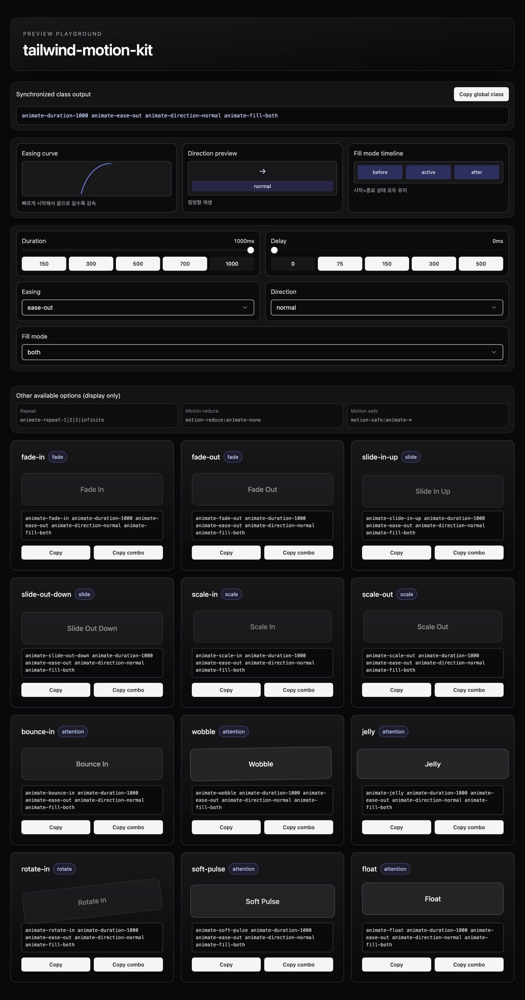

# tailwind-motion-kit

```text
┏━━━━━━━━━━━━━━━━━━━━━━━━━━━━━━━━━━━━━━━━━━━━━━━━━━━━━━━┓
┃     _____  _    ___ _ __        _____ _   _ ____      ┃
┃    |_   _|/ \  |_ _| |\ \      / /_ _| \ | |  _ \     ┃
┃      | | / _ \  | || | \ \ /\ / / | ||  \| | | | |    ┃
┃      | |/ ___ \ | || |__\ V  V /  | || |\  | |_| |    ┃
┃      |_/_/   \_\___|_____\_/\_/  |___|_| \_|____/     ┃
┗━━━━━━━━━━━━━━━━━━━━━━━━━━━━━━━━━━━━━━━━━━━━━━━━━━━━━━━┛
```

Tiny Tailwind animation kit for **fast, consistent UI motion**.

- Utility-first animation presets
- Predictable class composition
- Works great for toasts, modals, lists, and micro interactions

[Preview →](https://qpwoei0123.github.io/tailwind-motion-kit/)



---

## 30-sec quickstart

```bash
npm i tailwind-motion-kit
```

```js
// tailwind.config.js
const motionKit = require('tailwind-motion-kit')

module.exports = {
  content: ['./index.html'],
  plugins: [motionKit()],
}
```

```html
<div class="animate-fade-up animate-duration-300 animate-ease-out">Enter</div>
<div class="animate-slide-in-right animate-duration-300">Toast</div>
<div class="animate-jelly animate-duration-700 animate-ease-out">Attention</div>
```

---

## Presets

### fade
`fade-in`, `fade-out`, `fade-up`, `fade-down`, `fade-blur-in`, `fade-blur-out`, `blur-in`, `blur-out`, `focus-in`, `focus-out`, `glow-in`

### slide
`slide-in-up`, `slide-in-left`, `slide-in-right`, `slide-in-bottom`, `slide-out-down`, `slide-out-up`, `slide-out-left`, `slide-out-right`, `slide-out-bottom`, `accordion-down`, `accordion-up`

### scale
`scale-in`, `scale-out`, `zoom-in`, `zoom-out`

### attention
`bounce-in`, `wobble`, `jelly`, `soft-pulse`, `float`, `shake-x`

### rotate
`rotate-in`

---

## Utilities

- duration → `animate-duration-150|300|500|700|1000`
- delay → `animate-delay-0|75|150|300|500`
- easing → `animate-ease-linear|in|out|in-out`
- repeat → `animate-repeat-1|2|3|infinite`
- direction → `animate-direction-normal|reverse|alternate`
- fill mode → `animate-fill-none|forwards|backwards|both`

---

## Accessibility

```html
<div class="animate-fade-up motion-reduce:animate-none">Content</div>
```

Recommended:
- default: subtle motion (`animate-fade-up`, `animate-duration-300`)
- reduced motion: disable/simplify (`motion-reduce:animate-none`)

---

## Plugin options

```js
motionKit({
  durationScale: [120, 240, 360, 480],
  delayScale: [0, 50, 100, 150],
})
```

Generates:
- `animate-duration-120|240|360|480`
- `animate-delay-0|50|100|150`

---

## Recipes

### Toast enter
```html
<div class="animate-slide-in-right animate-duration-300 animate-ease-out">Saved!</div>
```

### Modal open
```html
<div class="animate-zoom-in animate-duration-240 motion-reduce:animate-none">...</div>
```

### Attention ping
```html
<button class="animate-soft-pulse animate-repeat-infinite">Notify</button>
```

---

## Agent CLI quick copy-paste

JSON-first CLI for coding agents and tooling.

### Start here

```bash
npx tmk --help
npx tmk manifest
npx tmk schema recommend
```

### 1) Recommend an animation for a UI moment

```bash
npx tmk action recommend --input '{"intent":"feedback","context":"cta click","include_tokens":true}'
```

```json
{
  "action": "recommend",
  "recommendation": {
    "name": "jelly",
    "class": "animate-jelly"
  }
}
```

### 2) Generate a ready-to-paste class bundle

```bash
npx tmk generate --input '{"animation":"slide-in-right","duration":300,"easing":"out"}'
```

```json
{
  "action": "generate",
  "className": "animate-slide-in-right animate-duration-300 animate-ease-out animate-fill-both motion-reduce:animate-none"
}
```

### 3) Resolve an existing class string back into tokens

```bash
npx tmk resolve --input '{"className":"animate-jelly animate-duration-500 animate-ease-in-out motion-reduce:animate-none"}'
```

```json
{
  "action": "resolve",
  "animation": {
    "name": "jelly"
  },
  "tokens": {
    "duration": "animate-duration-500",
    "easing": "animate-ease-in-out"
  }
}
```

### 4) Filter the bundled catalog

```bash
npx tmk action list-animations --input '{"intent":"enter","limit":5}'
printf '{"intent":"feedback","context":"cta click","include_tokens":true}' | npx tmk action recommend
```

### Command surface

- `tmk manifest` → best discovery entrypoint; includes commands, actions, token scales, and bundled animations
- `tmk schema [action-name]` → top-level contract or per-action input schema
- `tmk action <action-name>` → stable JSON action dispatcher
- `tmk generate` → convenience alias that returns a ready-to-paste motion class bundle
- `tmk resolve` → convenience alias that parses an existing motion class bundle

### Built-in actions

- `list-animations` → filter bundled animations by `intent` and/or `name`
- `recommend` → score animations for a requested `intent` + `context`
- `generate` → produce a practical class bundle from animation or intent + token overrides
- `resolve` → parse a class bundle into animation + timing tokens

### Contract notes for agents

- success responses are JSON on stdout
- failures are JSON on stderr with `ok: false` and exit code `1`
- unknown commands/actions include discovery hints and available command/action names
- unknown properties are rejected to keep the action surface stable
- `manifest` mirrors the machine-readable index in `./ai/index.json`
- manifest token lists are aligned with generated utilities, including `animate-delay-0`

See also:
- `./docs/agent-contract.md`
- `./ai/index.json`
- `./ai/schema.json`
- `./llms.txt`

## Local preview

### HTML
```bash
cd examples
npx tailwindcss -c tailwind.config.js -i input.css -o output.css --watch
```

### React + shadcn/ui
```bash
cd examples-react
npm install
npm run dev
```

Open `http://localhost:5173`.

---

## Pages deploy

Push `main` → Action runs → `examples/` deploys to GitHub Pages.

Workflow: `.github/workflows/deploy-pages.yml`
